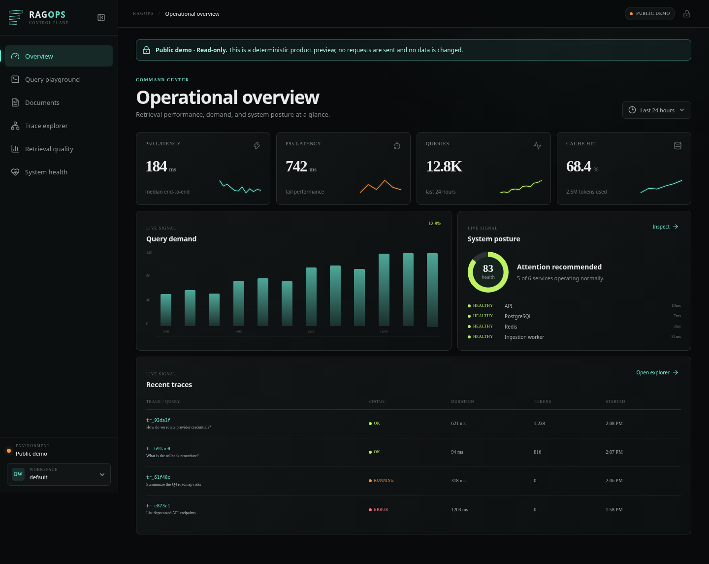
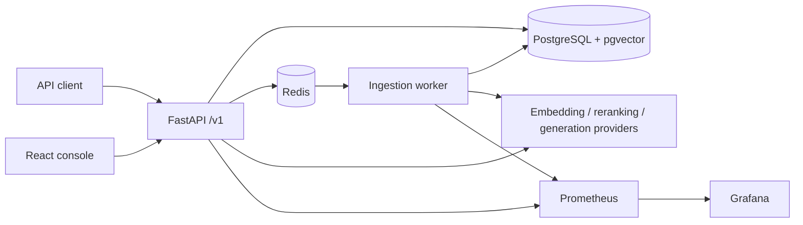

# RAGOps

**A credential-free reference platform for building, measuring, and operating retrieval-augmented generation.**

[](https://github.com/xmike04/RAG_OPS/actions/workflows/ci.yml)
[](https://github.com/xmike04/RAG_OPS/actions/workflows/pages.yml)
[](backend/pyproject.toml)
[](backend/pyproject.toml)

[**Watch the two-minute captioned walkthrough →**](docs/assets/ragops-two-minute-walkthrough.mp4)



RAGOps turns text and Markdown into searchable chunks, combines lexical and
vector retrieval, reranks the result set, and returns grounded answers with
citations. The same request produces an inspectable trace: component scores,
stage latency, token usage, cache behavior, and request IDs are available to
operators instead of disappearing behind a single chat response.

> **Project status:** development reference implementation. The local providers
> are deterministic and useful for demos and tests; they are not a substitute
> for a production embedding model, reranker, or language model.

## What it demonstrates

- Asynchronous ingestion with explicit job status and failure reporting
- Hybrid full-text and vector retrieval with reciprocal-rank fusion (RRF)
- Pluggable reranking, including an optional in-process Sentence Transformers
  cross-encoder, with deterministic key-free providers for the default stack
- Cited answers whose source chunks remain visible to API clients
- Per-query traces plus Prometheus metrics for latency and operational health
- Workspace-scoped resources and UUID-based public identifiers
- An offline retrieval evaluator for Recall@k, MRR, nDCG, citation proxies, and
  latency percentiles
- A React operator console for querying the corpus and inspecting system health
- Reproducible SciFact benchmarks using real Sentence Transformers models,
  canonical Okapi BM25, RRF, and cross-encoder reranking
- A concurrent HTTP load harness with retained p50/p95/p99 latency evidence

## Architecture



The API and worker share provider contracts, persistence models, and telemetry.
PostgreSQL is the system of record; Redis carries background work and transient
cache state. See [the architecture guide](docs/architecture.md) for request
flows, boundaries, and failure behavior.

## Quick start

Prerequisites: Docker with Compose v2, `make`, and `curl`.

```bash
cp .env.example .env
make up
make migrate
make seed
curl --fail http://localhost:8000/ready
```

Open the operator console at `http://localhost:3000`. The API is available at
`http://localhost:8000`; Prometheus and Grafana ports are listed in
[`docs/local-development.md`](docs/local-development.md).

No hosted-model key is required for the default stack. To stop it:

```bash
make down
```

## API example

```bash
curl --fail-with-body http://localhost:8000/v1/search \
  -H 'Content-Type: application/json' \
  -d '{
    "workspace_id": "00000000-0000-0000-0000-000000000001",
    "query": "How does reciprocal-rank fusion combine results?",
    "top_k": 5,
    "rerank": true
  }'
```

Every response includes `X-Request-ID`. Supply your own value to correlate a
client operation with logs and traces. The complete endpoint guide is in
[`docs/api.md`](docs/api.md).

## Measured evaluation

The real-model benchmark runs the 5,183-document BEIR SciFact corpus and 300
held-out test queries through four retrieval strategies: canonical Okapi BM25,
normalized `all-MiniLM-L6-v2` embeddings, RRF fusion, and a Sentence
Transformers cross-encoder trained only on SciFact's disjoint training split.
It records Recall@10, MRR@10, nDCG@10, and per-query p50/p95 latency alongside
model, dataset, environment, and code hashes.

| Pipeline | Recall@10 | MRR@10 | nDCG@10 | p50 | p95 |
| --- | ---: | ---: | ---: | ---: | ---: |
| BM25 | 0.7740 | 0.6186 | 0.6519 | 24.18 ms | 42.78 ms |
| Vector | 0.7833 | 0.6047 | 0.6451 | 14.51 ms | 27.60 ms |
| RRF | **0.8059** | **0.6472** | **0.6816** | 40.43 ms | 67.97 ms |
| Cross-encoder reranked | 0.5523 | 0.1757 | 0.2596 | 1,479.88 ms | 1,747.43 ms |

RRF was the strongest tested configuration. The deliberately small, train-only
cross-encoder was a negative result: it was slower and reduced held-out quality,
so it is retained as evidence rather than presented as an improvement. The live
API baseline completed **9,234/9,234 requests** at concurrency 8 with **24.56 ms
p50**, **31.75 ms p95**, and **307.69 requests/second** using deterministic local
providers. These numbers describe the recorded CPU host and workload, not a
production SLO.

See the [benchmark protocol and retained results](docs/benchmarking.md) and the
[HTTP load-test protocol](docs/load-testing.md). The commands below exercise the
small deterministic evaluator fixture used by CI; it is intentionally separate
from the published real-model evidence.

The evaluator is standard-library Python and runs without services or keys:

```bash
python evals/evaluate.py \
  --queries evals/datasets/queries.jsonl \
  --corpus evals/datasets/corpus.jsonl \
  --run evals/runs/reference.jsonl \
  --k 1,3,5
```

It reports macro Recall@k, MRR, binary nDCG, claim-level citation coverage, a
document-overlap faithfulness proxy, and latency count/p50/p95/max. The checked-in
run is a **deterministic evaluator fixture**, not a measured claim about the live
application. No live-system quality baseline has been published yet. Record a
release baseline only from a versioned corpus, query set, configuration, and
fresh run artifact; the protocol is in [`docs/evaluation.md`](docs/evaluation.md).

## Quality gates

```bash
make lint
make typecheck
make test
make build
make eval
make smoke
```

`make eval` is offline. `make smoke` targets a running stack and is intentionally
separate so unit and CI workflows remain credential-free.

Start the optional Prometheus and Grafana profile with `make up-observability`.

## Design tradeoffs

- RRF is stable across unlike score scales, but discards score magnitude.
- Deterministic local providers make behavior repeatable, not semantically
  competitive with production models.
- PostgreSQL keeps metadata, full-text search, and vectors transactional at the
  cost of tighter database coupling.
- The citation faithfulness metric is a lexical proxy. It catches missing or
  obviously unrelated evidence but cannot prove entailment.
- Background ingestion improves API responsiveness while introducing eventual
  consistency between document acceptance and searchability.

## Documentation

| Guide | Purpose |
| --- | --- |
| [Local development](docs/local-development.md) | Setup, commands, and common failures |
| [Architecture](docs/architecture.md) | Components, data flow, and runtime contracts |
| [API usage](docs/api.md) | Requests, responses, errors, and request IDs |
| [Retrieval design](docs/retrieval.md) | Chunking, fusion, reranking, and tuning |
| [Evaluation](docs/evaluation.md) | Dataset format, metrics, and release protocol |
| [Real-model benchmark](docs/benchmarking.md) | SciFact provenance, models, metrics, and retained results |
| [Load testing](docs/load-testing.md) | Concurrent workload, latency methodology, and retained results |
| [Operations runbook](docs/operations.md) | Health, alerts, diagnosis, backup, and recovery |
| [Security model](docs/security.md) | Trust boundaries, threats, and deployment controls |
| [Demo walkthrough](docs/demo.md) | A focused project tour and technical talking points |
| [Two-minute video script](docs/demo-video-script.md) | Recording plan for a concise technical walkthrough |

## Roadmap

- [x] Publish reproducible real-model retrieval and live-backend latency baselines
- [ ] Add per-workspace authentication and authorization adapters
- [ ] Add document update/delete workflows and retention policies
- [ ] Evaluate learned sparse retrieval and alternative fusion strategies
- [ ] Add distributed tracing export and durable ingestion dead-letter handling
- [ ] Exercise backup restoration and rolling upgrades in CI

RAGOps is released under the [MIT License](LICENSE). Contributions are welcome;
start with [CONTRIBUTING.md](CONTRIBUTING.md).
