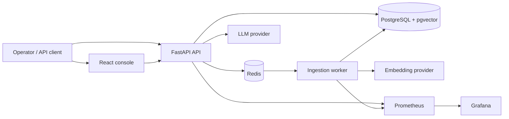
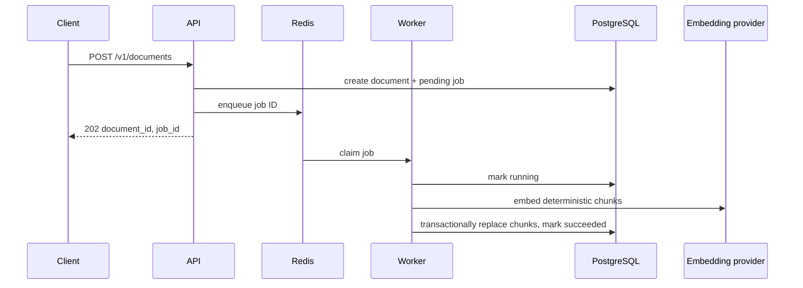
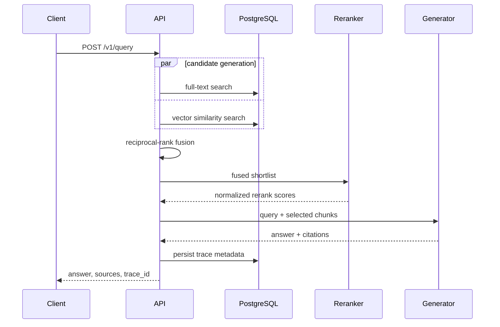

# RAGOps architecture

## Product goal

RAGOps is an observable, multi-workspace RAG platform that makes retrieval
quality and operational cost inspectable. It ingests text and Markdown, chunks
and embeds content, performs lexical and vector candidate generation, fuses the
rankings, reranks the shortlist, and produces grounded answers with citations.

## Runtime topology

The API is the only public application boundary. PostgreSQL is authoritative for
documents, chunks, jobs, and query traces. Redis is transient: queued ingestion
work and cache entries must be safe to recreate. The worker is horizontally
scalable only when job claim and document finalization remain idempotent.

## Stable API contract

All JSON endpoints live below `/v1` and return a request ID header.

| Method | Path | Purpose |
| --- | --- | --- |
| `POST` | `/v1/documents` | Submit a document and create an ingestion job |
| `GET` | `/v1/documents` | List documents in a workspace |
| `GET` | `/v1/ingestions/{job_id}` | Inspect ingestion progress or failure |
| `POST` | `/v1/search` | Run hybrid retrieval and optional reranking |
| `POST` | `/v1/query` | Generate a grounded, cited answer |
| `GET` | `/v1/traces` | Inspect recent query traces and stage timing |
| `GET` | `/v1/ops/summary` | Aggregate latency, tokens, cache, and quality data |
| `GET` | `/health` | Liveness check |
| `GET` | `/ready` | PostgreSQL and Redis readiness check |
| `GET` | `/metrics` | Prometheus exposition endpoint |

## Retrieval contract

Lexical and vector retrievers return ranked candidates with stable chunk IDs and
raw component scores. Reciprocal-rank fusion uses `1 / (k + rank)` and records
the contribution of each retriever. A reranker receives only the fused shortlist
and returns a normalized score plus provider/model metadata. Search responses and
query traces expose stage latency without leaking document contents into logs.

## Provider contract

Embedding, reranking, and generation use typed interfaces. Deterministic local
providers keep tests and the demo credential-free. Optional production providers
can load local Hugging Face models or call an OpenAI-compatible endpoint. Provider
selection is configuration-driven and validated at startup.

## Request flows

### Ingestion

The request accepts content but does not promise immediate searchability. Clients
poll the ingestion resource. A retry may repeat processing, so chunk identity and
final persistence must be deterministic or transactionally replaced.

### Search and answer generation

`/v1/search` ends after ranking. `/v1/query` continues through generation. Both
flows use the same retrieval stages so the search view can explain the context
chosen for an answer.

## Data ownership and isolation

Every document, chunk, ingestion job, and trace belongs to one workspace.
Workspace filtering is part of each database query, not a post-processing step.
Public IDs are UUIDs and do not encode tenant or database ordering. A future
authorization adapter must derive workspace identity from a principal; the local
demo accepts an explicit workspace identifier in requests and therefore is not an
internet-safe multi-tenant boundary.

Document text is stored in PostgreSQL and sent only to the configured embedding
or generation provider. Logs and metrics contain identifiers, sizes, states,
timings, and provider metadata—not raw document text or generated answers.
Query traces currently retain the user's query and generated answer for operator
inspection; treat the trace store and API as sensitive data surfaces.

## Consistency and failure behavior

| Event | Contract |
| --- | --- |
| API accepts a document | Document and pending job exist before work is queued |
| Queue delivery repeats | Processing is idempotent; one final chunk set is visible |
| Provider call fails | Job records a safe error category and can be retried |
| Redis is unavailable | Readiness fails; accepted work is never reported as complete |
| PostgreSQL is unavailable | Readiness fails and state-changing operations reject |
| Reranker is unavailable | Behavior follows configured fail-open/fail-closed policy |
| Generator returns invalid citations | Response validation rejects unknown chunk IDs |

The liveness endpoint reports that the process can serve requests. Readiness is
stricter and represents dependencies needed for normal traffic. Neither endpoint
should call an external model provider on every probe.

## Observability model

An inbound `X-Request-ID` is validated and propagated, or a new request ID is
created. Query traces record coarse request metadata and stage timings:
embedding, lexical retrieval, vector retrieval, fusion, reranking, and generation.
Trace records include query/answer text but do not duplicate full retrieved
documents. Metrics use bounded labels such as route, status class, and provider; workspace,
document, query, and request IDs remain in structured logs or trace records to
avoid unbounded Prometheus cardinality.

The system intentionally separates three signals:

- health: whether components can accept work;
- performance: latency, queue depth, error rates, tokens, and cache behavior;
- quality: offline relevance and citation metrics from a versioned evaluation.

Runtime telemetry cannot establish retrieval quality by itself.

## Configuration boundaries

Provider selection and connection details come from environment variables.
Configuration is validated before the process reports ready. Development
defaults use deterministic providers and local services. Production deployments
must provide authentication, TLS termination, secret management, resource
limits, database backup, and an explicit provider data-processing policy.

## Intentional constraints

- Text and Markdown are the initial ingestion formats; binary parsing and OCR are
  outside the core service.
- PostgreSQL full-text search and pgvector favor operational simplicity over
  independently scalable search clusters.
- RRF combines rank positions rather than attempting to calibrate unrelated
  lexical and vector score distributions.
- Query traces retain query/answer text for inspection but avoid full prompt and
  retrieved-document replay; deployments need access control and retention.

See the [retrieval guide](retrieval.md) for ranking details, the
[operations runbook](operations.md) for service diagnosis, and the
[security model](security.md) for production gaps.
