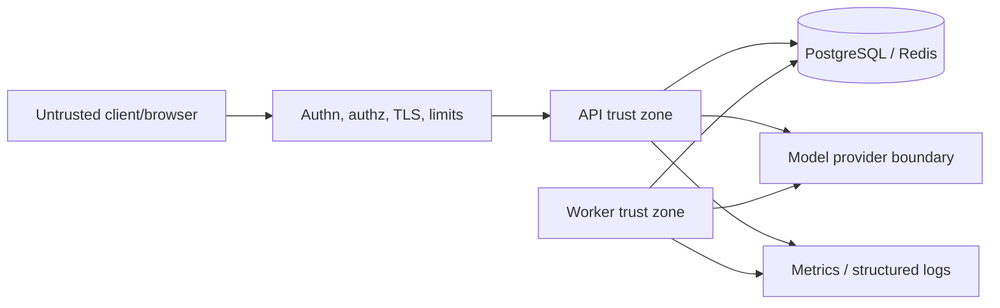

# Security and threat model

## Scope and assumptions

RAGOps processes untrusted document text and user queries. The local demo is not
an authenticated multi-tenant deployment. This model covers the API, worker,
PostgreSQL/pgvector, Redis, browser console, monitoring stack, and optional model
providers.

Protected assets include document contents, embeddings, generated answers,
provider credentials, database/queue credentials, workspace boundaries, audit
metadata, and service availability.

## Trust boundaries

The edge controls shown above are deployment requirements; the local request
workspace field is not authentication. A hosted model provider is a separate data
processor and receives only the content needed for its configured operation.

## Primary threats and controls

| Threat | Control or required mitigation |
| --- | --- |
| Cross-workspace data access | Derive workspace from authenticated principal; enforce it in every query; negative isolation tests |
| Prompt injection in documents | Treat retrieved text as data, delimit it, restrict tools, and keep system policy outside retrieved context |
| Malicious/oversized ingestion | Content-type and size limits, parsing timeouts, safe decoders, queue backpressure |
| SSRF through source URI | Do not fetch arbitrary URIs by default; use scheme/host allowlists and egress policy if fetching is added |
| SQL/filter injection | Parameterized SQL and explicit validated filter schemas |
| Secret disclosure | External secret store, scoped credentials, redaction, no secrets in browser variables/logs/traces |
| Sensitive text in telemetry | Log/metric IDs, sizes, categories, and timings; restrict and expire query traces, which currently retain query/answer text |
| Citation spoofing | Accept citations only to chunks supplied as context and validate workspace ownership |
| Queue replay/duplication | Idempotent job processing and transactional finalization |
| Resource exhaustion | Request/body limits, timeouts, concurrency limits, rate limits, bounded `top_k` and context |
| Dependency compromise | Pinned dependencies, lockfiles, image digest policy, vulnerability scanning and timely updates |
| Metrics cardinality attack | Bounded label allowlists; identifiers remain in structured logs/traces |

Prompt injection is not solved by better wording alone. Retrieval content must
not gain authority to change system policy, disclose unrelated data, or invoke
tools. If tool use is added, each tool requires its own authorization and input
validation independent of model output.

## Production checklist

- Terminate TLS and reject plaintext at the deployment boundary.
- Authenticate users/services and authorize the selected workspace server-side.
- Use least-privilege, distinct credentials for API, worker, migrations, and
  monitoring; rotate and audit them.
- Keep PostgreSQL, Redis, Prometheus, and Grafana off public networks.
- Restrict CORS to known origins and set browser security headers.
- Apply body, query-length, `top_k`, timeout, concurrency, and rate limits.
- Encrypt durable storage and backups; test restoration and deletion procedures.
- Define document/trace retention and provider data-processing policies.
- Disable or protect API documentation and diagnostic endpoints as appropriate.
- Scan dependencies and container images, sign release artifacts, and patch the
  base images on a defined cadence.
- Run workspace-isolation, prompt-injection, citation, and abuse-case tests.

## Data lifecycle

Deletion must cover document metadata, chunks, embeddings, caches, and queued
work. Traces currently contain query and answer text; their retention should be shorter than document retention unless a clear
operational or compliance need says otherwise. Backups require a documented
expiration window because deletion cannot rewrite every historical snapshot.

## Residual risks

Embeddings may reveal information about source text and should be protected like
derived sensitive data. A cited answer can still misinterpret evidence. Learned
providers may retain or process inputs according to external terms. Operators
must assess those risks for their data classification and jurisdiction.

See [`SECURITY.md`](../SECURITY.md) for private vulnerability reporting.
